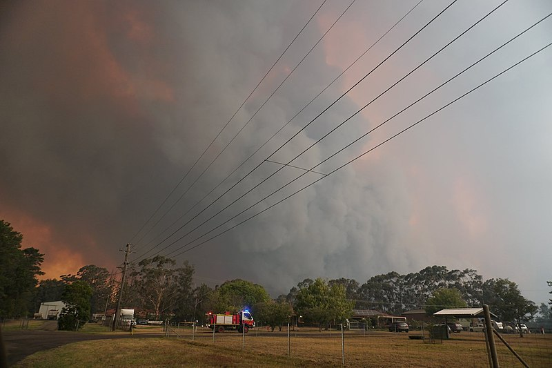

```{r setup, include=FALSE}
options(htmltools.dir.version = FALSE)
knitr::opts_chunk$set(
  fig.width=5, fig.height=5, fig.retina=3,
  out.width = "100%",
  cache = FALSE,
  echo = FALSE,
  message = FALSE, 
  warning = FALSE,
  hiline = TRUE
)
```


```{r eval=FALSE}
library(RefManageR)
BibOptions(check.entries = FALSE,
           bib.style = "authoryear",
           cite.style = "apa",
           style = "Bibtex",
           # max.names = 3,
           longnamesfirst = FALSE,
           hyperlink = FALSE,
           dashed = FALSE)
myBib <- ReadBib("./Visual Inference.bib", check = FALSE)
```

```{r xaringan-themer, include=FALSE, warning=FALSE}
library(xaringanthemer)
library(tidyverse)
library(visage)
style_solarized_light(
  background_color = "#FFFFFF",
  header_font_google = google_font("Josefin Sans"),
  text_font_google   = google_font("Montserrat", "300", "300i"),
  code_font_google   = google_font("Fira Mono"),
  text_color = "#000000",
  text_font_size = "1.0rem",
  colors = c(mywhite = "#FFFFFF")
)
```

count: false

<!-- need a backaground image -->

.pull-left-full[

<h1 class="myblue">spotoroo: spatiotemporal clustering in R of hotspot data</h1>


<h4 class="myblue"> Di Cook award presentation </h3>


<br>
<br>

<h3 class="myblue"> Weihao (Patrick) Li </h3>

<h4 class="myblue"> Department of Econometrics and Business Statistics, Monash University </h4>

<h4 class="myblue"> <i class="fa fa-envelope" aria-hidden="true"></i> weihao.li@monash.edu </h4>

<h4 class="myblue"> May 17, 2022 </h4>

<!-- <h3 class="myblue"> `r format(Sys.Date(), format="%B %d, %Y")` </h3> -->
]


.pull-right-110[

```{r}
load("data/VIC_result.rda")
library(spotoroo)


plot(result, bg = plot_vic_map()) -> p

p$layers[[3]]$aes_params$size <- 1

p
```

]

---

# 👨‍🚒 2019-2020 Australian bushfire season 👩‍🚒

.pull-left[

<br>
<br>

#### A catastrophic and unprecedented disaster.

#### By the end of 2020, 

- almost $19$ million hectares of land burned
- over $3000$ homes destroyed 
- AUD $ $1.7$ billion in insurance losses
- an estimated $1$ billion animals killed
]


.pull-right-center[


.caption[
Fig. 1: _An out of control bushfire in Werombi, NSW (Wikimedia Commons, 2019)._ 
]
]


---

# 📡 Remote sensing data

.pull-left[

```{r cache=TRUE, fig.height=6, fig.width=8}
library(tidyverse)
library(sf)
library(gganimate)
hotspot_raw <- read_csv("data/VIC_hotspots_raw.csv") %>%
  filter(firepower > 100) 

hotspot_raw_sf <- st_as_sf(hotspot_raw, coords = c("lon", "lat"), crs = 4326)

ggplot(hotspot_raw_sf) +
  geom_sf(data = vic_map) +
  geom_sf(col = "black", alpha = 0.1) +
  theme_light()
```

.caption[
Fig. 2: _Himawari-8 hotspot data in Victoria from October 2019 to March 2020._ 
]

]

.pull-right[

<br>
<br>

#### **Remote satellite data** provides a potential solution to the challenge of active fire detection and monitoring.

#### Japan Aerospace Exploration Agency (JAXA) **Himawari-8 satellite** wildfire product:
- $1989572$ hotspots in Australia from October 2019 to March 2020 
- $0.02^\circ$ (~ $2$ kms) spatial grid resolution
- $10$ minutes temporal resolution

]

---

# 👨‍💻 Authors of `spotoroo` 👩‍💻

The clustering algorithm was developed in 2019, and made available in the `spotoroo` package in March, 2021.

```r
install.packages("spotoroo")
library(spotoroo)
```

<br>

- Author, maintainer: **Weihao (Patrick) Li**

- Contributor: **Prof. Di Cook**
  - Professor of Business Analytics at Monash University.

- Contributor: **Emily Dodwell**
  - Principal Inventive Scientist at AT&T.

---

# 1️⃣ Divide hotspots into intervals

#### `activeTime`: the maximum amount of time a fire may stay smoldering but undetectable by satellite before flaring up again

#### Assumes the hour index start from $1$.

$$
\begin{align*}
S_1 &= \text{hotspots observed from hour}~1~\text{to hour}~1\\
S_2 &= \text{hotspots observed from hour}~1~\text{to hour}~2\\
\vdots\\
S_{activeTime} &= \text{hotspots observed from hour}~1~\text{to hour}~activeTime\\
S_{activeTime+1} &= \text{hotspots observed from hour}~2~\text{to hour}~activeTime+1\\
\vdots\\
S_{T} &= \text{hotspots observed from hour}~T-activeTime~\text{to hour}~T\\
\end{align*}
$$


In summary, data will be divided into $T$ intervals

$$S_t = [max(1,t-activeTime),t]\quad t = 1,2,...,T.$$

---

# 2️⃣ Cluster hotspots spatially within each time interval

.pull-left[

<br>
<br>
<br>

#### For each time interval $S_t$, connect all hotspots within `adjDist` to form a graph

#### Every **connected component** of the graph is an individual cluster


]


.pull-right[

```{r fig.width=8, fig.height=6}
font_size <- 20
point_size <- 7

set.seed(1256)
x <- rnorm(10, mean = 0, sd = 3)
y <- rnorm(10, mean = 0, sd = 2)
x <- c(x,rnorm(10, mean = 5, sd = 2))
y <- c(y,rnorm(10, mean = 5, sd = 3))
points <- data.frame(x=x, y=y)

x <- c(x,rnorm(10, mean = 6, sd = 2))
y <- c(y,rnorm(10, mean = 7, sd = 2))
points_2 <- data.frame(x=x, y=y)

ggplot(points) +
  geom_point(aes(x,y), size = point_size/3) +
  coord_fixed() +
  theme_bw(base_size = font_size) +
  theme(axis.line=element_blank(),
      axis.text.x=element_blank(),
      axis.text.y=element_blank(),
      axis.ticks=element_blank(),
      axis.title.x=element_blank(),
      axis.title.y=element_blank()) +
  theme(legend.position = "none") +
  scale_color_manual(values = "red") +
  labs(col = "") +
  ggtitle(quote(S[t]~before~clustering)) -> p1

point_cols <- rep(1, 20)
point_cols[c(2, 3, 4, 7, 11, 18, 5, 12, 13, 14, 15, 16, 17, 18)] <- 2
point_cols[19] <- 3
point_cols[20] <- 4

seg_dat <- tibble(x = 0, y = 0, xend = 0, yend = 0)

for (i in 1:nrow(points)) {
  for (j in 1:nrow(points)) {
    if ((points$x[i] - points$x[j])^2 + (points$y[i] - points$y[j])^2 < 9) {
      seg_dat <- add_row(seg_dat, 
                         x = points$x[i], y = points$y[i], 
                         xend = points$x[j], yend = points$y[j])
    } 
  }
}

ggplot() +
  geom_segment(data = seg_dat, aes(x, y, xend = xend, yend = yend), alpha = 0.25) +
  geom_text(data = points, aes(x, y, label = point_cols), size = point_size) +
  coord_fixed() +
  theme_bw(base_size = font_size) +
  theme(legend.position = "none") +
  theme(axis.line=element_blank(),
      axis.text.x=element_blank(),
      axis.text.y=element_blank(),
      axis.ticks=element_blank(),
      axis.title.x=element_blank(),
      axis.title.y=element_blank()) +
  ggtitle(quote(S[t]~after~clustering)) -> p2

library(patchwork)

p1 + p2
```

]


---

# 3️⃣ Update memberships for hotspots

```{r}
font_size <- 20
point_size <- 7

point_cols2 <- rep("a", 30)
point_cols2[19] <- "b"
point_cols2[c(1, 8, 6, 9, 10)] <- "c"

X1 <- as.data.frame(points_2[point_cols2 == "a",])
hull_1 <- chull(X1)
hull_1 <- c(hull_1, hull_1[1])

X2 <- as.data.frame(points_2[point_cols2 == "c",])
hull_2 <- chull(X2)
hull_2 <- c(hull_2, hull_2[1])

ggplot(data = mutate(points_2, group = rep("", 30))) +
  geom_point(aes(x, y)) +
  geom_polygon(data = X1[hull_1,], aes(x=x, y=y), fill = "black", alpha = 0.1) +
  geom_polygon(data = X2[hull_2,], aes(x=x, y=y), fill = "black", alpha = 0.1) +
  coord_fixed() +
  theme_bw(base_size = font_size) +
  theme(legend.position = "right") +
  theme(axis.line=element_blank(),
      axis.text.x=element_blank(),
      axis.text.y=element_blank(),
      axis.ticks=element_blank(),
      axis.title.x=element_blank(),
      axis.title.y=element_blank()) +
  ggtitle(bquote(S[t]~"before updating")) -> p1
```


```{r}
ggplot() +
  geom_text(data = points_2[1:20, ], aes(x, y, label = point_cols), col = "blue", size = point_size) +
  geom_point(data = points_2[21:30, ], aes(x, y), col = "red", size = point_size/3) +
  geom_polygon(data = X1[hull_1,], aes(x=x, y=y), fill = "black", alpha = 0.1) +
  geom_polygon(data = X2[hull_2,], aes(x=x, y=y), fill = "black", alpha = 0.1) +
  coord_fixed() +
  theme_bw(base_size = font_size) +
  theme(axis.line=element_blank(),
      axis.text.x=element_blank(),
      axis.text.y=element_blank(),
      axis.ticks=element_blank(),
      axis.title.x=element_blank(),
      axis.title.y=element_blank()) +
  labs(col = "", 
       shape = expression("Hotspots "*" in "*S[t-1]), 
       title = expression(Adopt~information~from~S[t-1])) -> p2
```


```{r}
final_labels <- c(point_cols, 4, 2, 4, 4, 2, 2, 2, 4, 4, 2)

X1 <- as.data.frame(points_2[final_labels == "1",])
hull_1 <- chull(X1)
hull_1 <- c(hull_1, hull_1[1])

X2 <- as.data.frame(points_2[final_labels == "2",])
hull_2 <- chull(X2)
hull_2 <- c(hull_2, hull_2[1])

X3 <- as.data.frame(points_2[final_labels == "3",])
hull_3 <- chull(X3)
hull_3 <- c(hull_3, hull_3[1])

X4 <- as.data.frame(points_2[final_labels == "4",])
hull_4 <- chull(X4)
hull_4 <- c(hull_4, hull_4[1])

ggplot() +
  geom_text(data = points_2, aes(x, y, label = final_labels, col = c(1:30)<=20), size = point_size) +
  geom_polygon(data = X1[hull_1,], aes(x=x, y=y), fill = "black", alpha = 0.1) +
  geom_polygon(data = X2[hull_2,], aes(x=x, y=y), fill = "black", alpha = 0.1) +
  geom_polygon(data = X3[hull_3,], aes(x=x, y=y), fill = "black", alpha = 0.1) +
  geom_polygon(data = X4[hull_4,], aes(x=x, y=y), fill = "black", alpha = 0.1) +
  coord_fixed() +
  theme_bw(base_size = font_size) +
  theme(legend.position = "none") +
  theme(axis.line=element_blank(),
      axis.text.x=element_blank(),
      axis.text.y=element_blank(),
      axis.ticks=element_blank(),
      axis.title.x=element_blank(),
      axis.title.y=element_blank()) +
  labs(col = expression("Hotspots "*" in "*S[t-1]), title = expression(S[t]~after~updating)) +
  scale_color_manual(values = c("red", "blue")) -> p3
```


#### Some hotspots in $S_t$ have been clustered in $S_{t-1}$

#### Update the membership by finding the nearest label

<br>

<div style="width: 80%; margin: auto;">

```{r fig.width=16, fig.height=6}
p1 + p2 + p3
```


</div>


---

# 4️⃣ Handle noise in the clustering result

<br>
<br>
<br>

- `minPts`: the minimum number of hotspots in a cluster
- `minTime`: the minimum time a cluster can exist and still be considered a bushfire

<br>
<br>

#### Any cluster that does not satisfy these two conditions will be reassigned membership label $-1$ to indicate they represent noise.


---

# ⚙️ Usage

```r
result <- hotspot_cluster(hotspots,
                          activeTime = 24,
                          adjDist = 3000,
                          minPts = 4,
                          minTime = 3,
                          timeUnit = "h",
                          timeStep = 1)
```


.font-05[

```
───────────────────────────────────── SPOTOROO 0.1.2 ─────────────────────────────────────

── Calling Core Function : `hotspot_cluster()` ──

── "1" time index = 1 hour 
✓ Transform observed time → time indexes
ℹ 4313 time indexes found

── activeTime = 24 time indexes | adjDist = 3000 meters 
✓ Cluster                                                                               
ℹ 1055 clusters found (including noise)

── minPts = 4 hot spots | minTime = 3 time indexes 
✓ Handle noise
ℹ 407 clusters left
ℹ noise proportion : 4.342 %

── ignitionCenter = "mean" 
✓ Compute ignition points for clusters
ℹ average hot spots : 178.5
ℹ average duration : 43.4 hours

── Time taken = 5 mins 36 secs for 75936 hot spots 
ℹ 0.004 secs per hot spot

───────────────────────────────────────────────────────────────────────────────
```

]

---

# 📖 Summary of the clustering result

```r
summary(result)
```

.high-pre[

```
───────────────────────────────────── SPOTOROO 0.1.2 ─────────────────────────────────────

── Calling Core Function : `summary_spotoroo()` ──

CLUSTERS: ALL
OBSERVATIONS: 75936
FROM: 2019-10-01 03:20:00
TO:   2020-03-28 19:40:00


── Clusters 
ℹ Number of clusters: 407

Observations in cluster
        Min.     1st Qu.        Mean     3rd Qu.        Max.
         4.0        17.0       178.5       159.0      3863.0
Duration of cluster (hours)
        Min.     1st Qu.        Mean     3rd Qu.        Max.
         2.3         9.7        43.4        63.4       285.5

── Hot spots (excluding noise) 
ℹ Number of hot spots: 72639

Distance to ignition points (m)
        Min.     1st Qu.        Mean     3rd Qu.        Max.
         0.0      2844.5      7615.0      9649.2     40112.3
Time from ignition (hours)
        Min.     1st Qu.        Mean     3rd Qu.        Max.
         0.0        17.8        50.7        73.5       285.5

── Noise 
ℹ Number of noise points: 3297 (4.34 %)


──────────────────────────────────────────────────────────────────────────────────────────
```

]

---

# 📊 Visualizing the clustering result

.pull-left[

<h4 style="margin-top:0;">Spatial distribution of clusters</h4>

```{r echo = TRUE, fig.width=6, fig.height=4.5}
plot(result, bg = plot_vic_map(), 
     cluster = c(58, 83, 129, 163))
```

]

.pull-right[


<h4 style="margin-top:0;">Fire movement plot</h4>

```r
plot(result, type = "mov", step = 12, 
     cluster = c(58, 83, 129, 163))
```
```{r fig.width=6, fig.height=4.5}
plot(result, type = "mov", step = 12, cluster = c(58, 83, 129, 163)) -> p

p$layers[[1]]$aes_params$alpha <- 0.1

p
```


]

---

# 📊 Visualizing the clustering result

#### Timeline plot


.center-div[

```{r echo = TRUE, fig.width=10, fig.height=4.5}
plot(result, type = "timeline")
```

]

---

class: center, middle

# Thanks!

---

# Bibliography

Wikimedia Commons (2019). "Werombi Bushfire". [https://commons.wikimedia.org/wiki/File:Werombi_Bushfire.jpg](https://commons.wikimedia.org/wiki/File:Werombi_Bushfire.jpg)

Li, W., Dodwell, E., & Cook, D. (2021). A Clustering Algorithm to Organize Satellite Hotspot Data for the Purpose of Tracking Bushfires Remotely. https://github.com/TengMCing/Hotspots-Clustering-Algorithm/blob/master/li-dodwell-cook/RJwrapper.pdf
